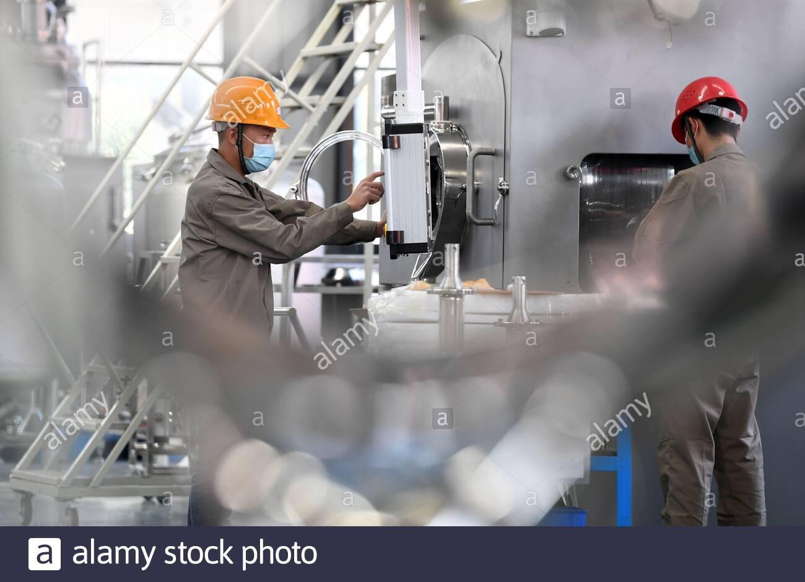
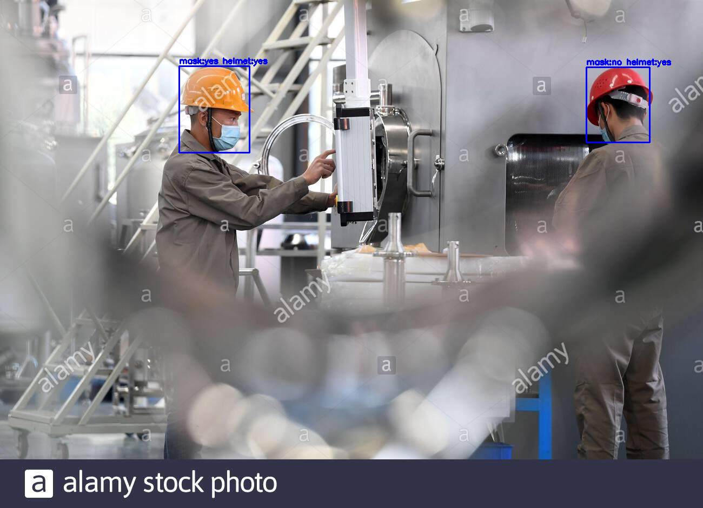
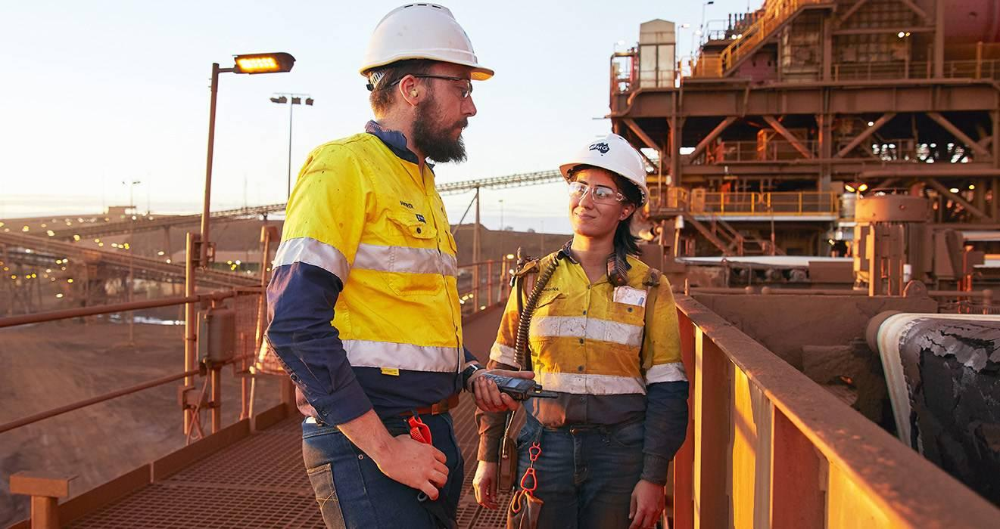
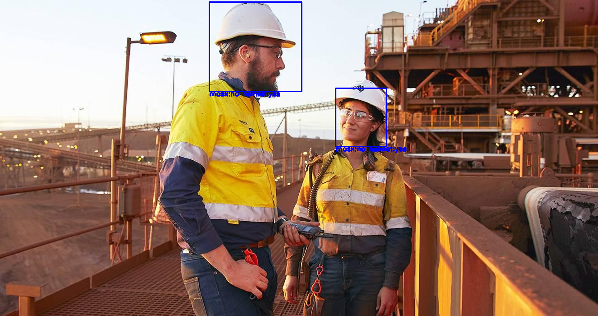
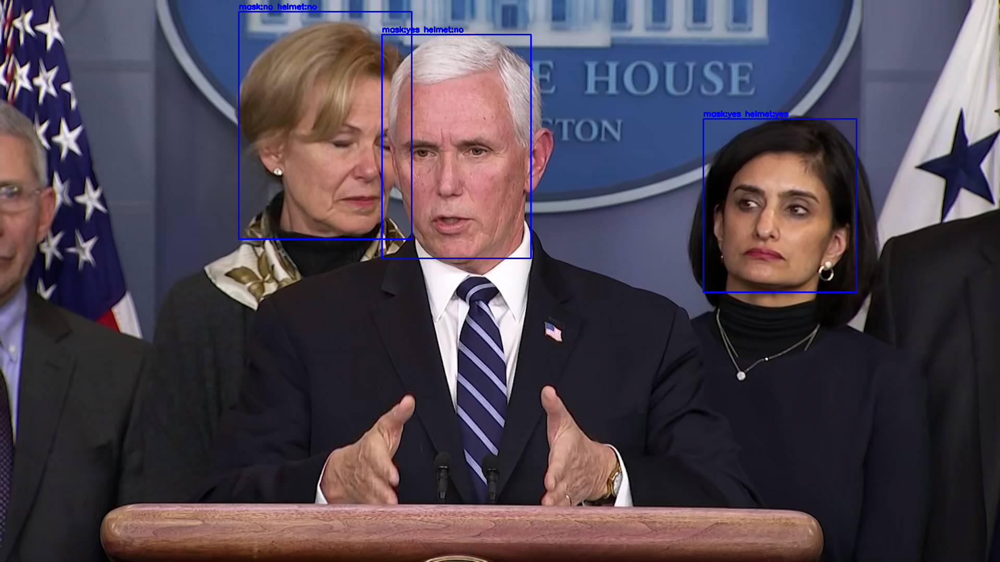
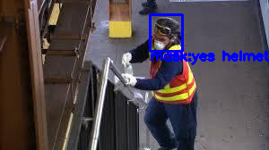

# Helmets-Masks
Using Object Detection and Classification for security at construction sites

The main file for object detection and classification is Integration_yolo&NN_models.ipynb. Final integration is done in that-

1. Retrained YoloV3 model is used to detect heads in images
2. Two neural network models trained for mask and helmet detection are used.

# Approach
It mainly consist of two tasks.

First is the object detection i.e. detection of heads from the frame. For that i have used state-of-the-art YOLO V3 model(though the newest v4 is also available). I have trained around 1500 iterations for that as only single object was there. 

Training is in file [YOLO_Training.ipynb](https://github.com/hammer1234567/Helmets-Masks/blob/master/YOLO_Training.ipynb).

Second task was to train neural network models for detecting masks and helmets. I used the concept of transfer learning and used VGG16(just for simplicity) model and retrained it after adding few layers in the model and freezing the previous ones.

Training file is [Mask&Helmet_models_training.ipynb](https://github.com/hammer1234567/Helmets-Masks/blob/master/Mask%26Helmet_models_training.ipynb)

The accuracy is of helmet detection model is fine but mask detection is not up to the mark we surely need more data to increase accuracy and can also try some better models than VGG16.

## Evaluation Metrics
### For YOLO model
The default metric is mAP(i.e. mean Average Precision) but if we don't want to use it **mAR(i.e. mean Average Recall)** can be used **to optimize your model for high recall and accurate object localization**.  

### For Neural Networks
For the mask model used categorical crossentropy to optimize the loss and for helmet i have used binary crossentropy. 

Surely this should be changed on the basis of real world application of model. One may precisely wants to minimize the number of False positives or number of False negatives. It can be changed accordingly for better results.

# Results Example
**Image**

**Result**

**Image**

**Result**

**Image**

**Result**

**Image**

**Result**

